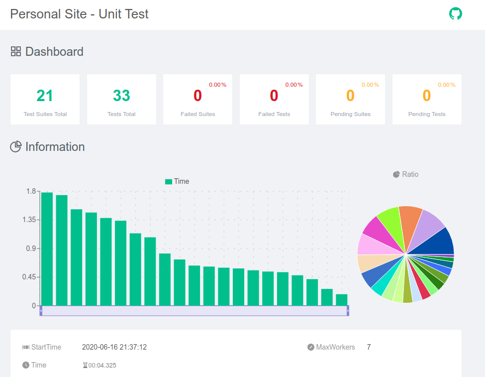
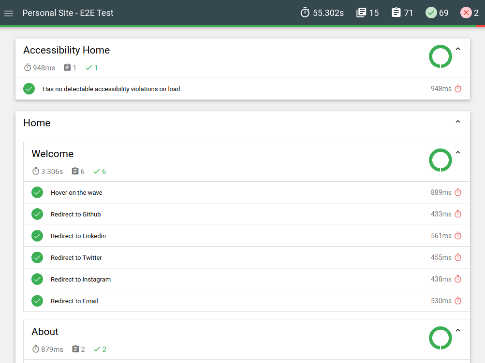
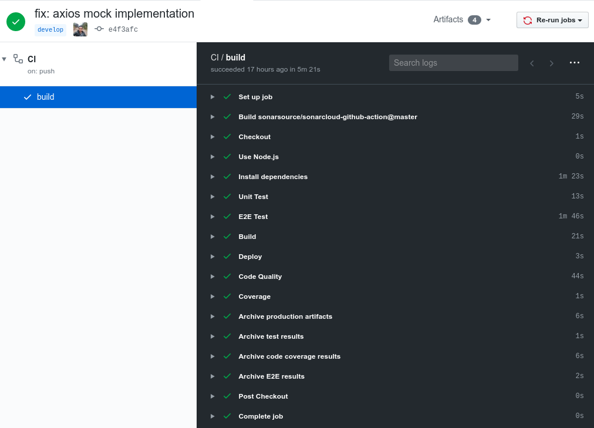

<div align="center">
  
</div>

<h1 align="center">
  Personal Site
</h1>

<p align="center">
  <a href="https://github.com/ldiego73/ldiego73.github.io/blob/develop/LICENSE" target="_blank" rel="noopener noreferrer">
    
  </a>
  <a href="https://github.com/ldiego73/ldiego73.github.io/actions" target="_blank" rel="noopener noreferrer">
    
  </a>
  <a href="https://sonarcloud.io/dashboard?id=ldiego73.github.io" target="_blank" rel="noopener noreferrer">
    
  </a>
  <a href="https://sonarcloud.io/dashboard?id=ldiego73.github.io" target="_blank" rel="noopener noreferrer">
    
  </a>
  <a href="https://coveralls.io/github/ldiego73/ldiego73.github.io?branch=develop" target="_blank" rel="noopener noreferrer">
    
  </a>
  <a href="https://sonarcloud.io/dashboard?id=ldiego73.github.io" target="_blank" rel="noopener noreferrer">
    
  </a>
  <a href="https://sonarcloud.io/dashboard?id=ldiego73.github.io" target="_blank" rel="noopener noreferrer">
    
  </a>
</p>

<div align="center">
  
</div>

## Description

This project was built using the Gatsby Framework and Github Pages. You can see the live page at the next link: https://ldiego73.github.io. 

I shared the code of my website with the goal of which is a guide for those who are looking to have your website quickly and easily.

## 🚨 Forking this repo

Yes, you can fork this repository. Please give me the proper credit by linking to https://ldiego73.github.io. Thank you!

## Summary

1. [Getting started](#getting-started)
2. [Start your project](#start-your-project)
3. [Build and running your project](#build-and-running-your-project)
3. [Testing your project](#testing-your-project)
4. [Deploy on Github Pages](#deploy-on-github-pages)
5. [Architecture](#architecture)
6. [Project structure](#project-structure)
7. [FAQ](#faq)

## Getting started

### Update your environments 

Change the values of the `.env` file for yours

| environment             | description                                                                               |
|-------------------------|-------------------------------------------------------------------------------------------|
| GATSBY_RECAPTCHA_KEY    | Key generated by google recaptcha                                                         |
| GATSBY_GITHUB_USER      | Your Github User ID                                                                       |
| GATSBY_GETFORM_URL      | URL generated when creating your form at https://getform.io/                              |
| GATSBY_LANGUAGE_DEFAULT | The default language of your site. Example: `en`                                          |
| GATSBY_LANGUAGE_VERSION | Allows you to update the language resources stored in the `localstorage`. Example: `v1.0` |

### Update your languages

Inside the `static / locales` path you can update your site information.

| locale resource       | description                                                        |
|-----------------------|--------------------------------------------------------------------|
| educations.json       | Contains an array of the places where you studied. *             |
| experiences.json      | Contains an array of the places where you worked until today. * |
| personal.skills.json  | List of your personal skills *                                     |
| technical.skills.json | List of your technical skills *                                    |
| translation.json      | Contains the website information                                   |

(*) I recommend not exceeding 5 records.

### Update your social networks

This information is located int the path `src/data/social_networks.json`

Example:

```json
{
  "url": "https://github.com/<USERNAME>",
  "name": "Github",
  "icon": "fab fa-github"
}
```

| value | description                                                                               |
|-------|-------------------------------------------------------------------------------------------|
| url   | The redirect url to social network                                                        |
| name  | The title the your link                                                                   |
| icon  | The icon associated with your social network. Icons are based on https://fontawesome.com/ |

You can freely add or remove the social networks you want to show.

### update your Site Public URL.

In order to correctly generate the sitemap.xml and robots.txt files you must ensure that the URL is public.

Inside the `gatsby-config.js` file you should change the next values:

```json
  title: `<TITLE YOUR PAGE>`,
  description: `<DESCRIPTION YOUR PAGE>`,
  author: `<YOUR NAME OR NICKNAME>`,
  siteUrl: `<SITE PUBLIC URL>`
```

## Start your project

After making the lines mentioned above configurations, execute the following command

```sh
yarn develop
```

Don't forget to previously install the dependencies

```sh
yarn install
```

## Build and running your project

Generate your public folder.

```sh
yarn build
```

preview your site before being published

```sh
yarn serve
```

## Testing your project

This project has a coverage of 90% to do this Unit Test and E2E Test was implemented.

### Unit Test

Unit tests have been built using Jest to run them use the next command:

```sh
yarn test:unit
```

The unit test generates two files in the next path `reports/test`

**1. result.html**

This report was generated using the `jest-html-reporters` dependency.

Details of the name, path configuration can be found in the file `jest.config.js`.

You can see the result inside the `reports/test/result.html` path



**1. result.xml**

This report is generated in order to upload the results in sonar cloud. The `jest-sonar-reporter` dependency has been used to generate the report. 

Details of the name, path configuration can be found in the file `package.json`.

You can see the result inside the `reports/test/result.xml` path.

If you want to remove this report when running the test, perform the next steps:

1. Remove this configuration into the `package.json`

```json
"jestSonar": {
  "reportPath": "reports/test",
  "reportFile": "result.xml",
  "indent": 4
}
```

2. Remove execution after running unit tests into the `package.json`

```json
"posttest:unit": "node jest-sonar",
```

3. Remove the file `jest-sonar.js`
4. Remove the dependency `jest-sonar-reporter`

```json
yarn remove jest-sonar-reporter
```

### E2E Test

For e2e tests cypress was used

Using visual testing:

```sh
yarn test:e2e
```

Using with CI:

```sh
yarn test:e2e:ci
```

The unit test generates four results in the next path `reports/e2e`

**1. results**

XML files with the result of each test.

**2. screenshots**

Contains the images of the tests that were unsuccessful.

**3. videos**

List of videos in mp4 of the test execution.

**4. result.html**

The next dependencies were used to generate the report:

```sh
yarn add -D mochawesome mochawesome-merge mochawesome-report-generator
```

Details of the path configuration can be found in the file `cypress.json`.

You can see the result inside the `reports/e2e/result.html` path



## Deploy on Github Pages

- Create **\<username>.github.io** repository
- Run `yarn build` in your directory
- Upload the folder `public` into repository.
- Open **\<username>.github.io** in the browser

### Using Github actions

In the `workflows` folder you will find the script to make the CD (Continuos deployment).

You can configure if you want to add or remove some steps.



For example you can skip the step of sonar cloud and coveralls if you don't need it.

- Remove the step `Code Quality`
- Remove the step `Coverage`

More details of use and documentation can visit the help of github actions (https://help.github.com/es/actions)

## Architecture

The architecture of the project is based on two important aspects:

1. [Modern web architecture](docs/modern-web-architecture.md)
2. [Serverless web application​](docs/serverless-web-application.md)

## Project structure

This project is structured by the next components.

```
├──__mocks__
├── cypress
│   ├── e2e
│   ├── fixtures
│   ├── plugins
│   └── support
├── src
│   ├── components
│   │   ├── footer
│   │   ├── header
│   │   ├── repository
│   │   ├── skills
│   │   ├── timeline
│   │   ├── top-button
│   │   └── seo.js
│   ├── context
│   │   ├── translation.context.js
│   │   └── translation.provider.js
│   ├── data
│   │   └── social_networks.json
│   ├── hooks
│   │   ├── use-fetch.js
│   │   └── use-hover.js
│   ├── images
│   ├── layouts
│   │   └── main.js
│   ├── pages
│   │   ├── 404.js
│   │   └── index.js
│   ├── screens
│   │   ├── home
│   │   │   ├── components
│   │   │   └── index.js
│   │   └── not-found
│   │   │   └── index.js
│   ├── styles
│   │   ├── componentes
│   │   ├── pages
│   │   ├── _variables.scss
│   │   └── theme.scss
│   └── utils
│   │   ├── browser.js
│   │   └── i18n.js
└── test
│   ├── components
│   ├── context
│   ├── hooks
│   ├── layouts
│   ├── pages
│   ├── screens
│   └── utils
```

## FAQ

### How to change colors?

The color palette is in the next path: `src/styles/_variables.scss`
The colors are:

| Color        | Hex                                                                |
|--------------|--------------------------------------------------------------------|
| $primary     |  `#252526` |
| $secondary   |  `#1e1e1e` |
| $tertiary    |  `#0a0a0a` |
| $quaternary  |  `#468fc2` |
| $color       |  `#cccccc` |
| $color-error |  `#b71c1c` |

### How to change favicon ?

- Change the file `icon.png` in the **src/images** folder.
- Change the file `icon.png` in the images folder.
