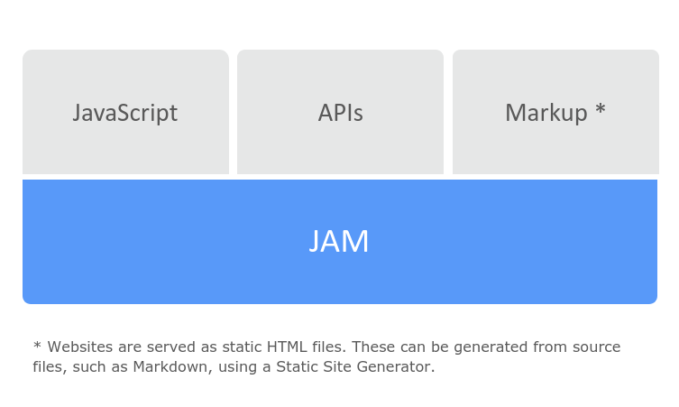
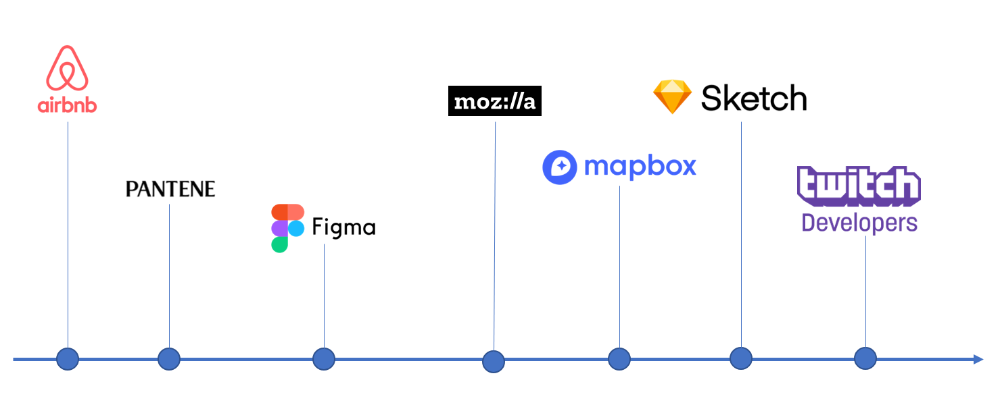
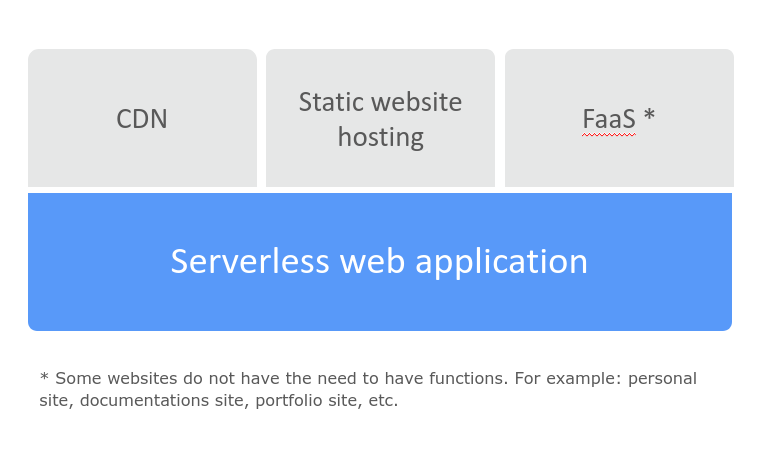

# Personal Site


Personal Site using Gatsby and Github Pages

## Modern web architecture

This site was built using a modern web development architecture based on client-side JavaScript, reusable APIs, and prebuilt Markup.


### Structure



### Who use?



### Benefits

#### 1. Faster performance

Serve pre-built markup and assets over a CDN.

#### 2. Less expensive​

Hosting of static files are cheap or even free.​

#### 3. Better developer experience​

Front end developers can focus on the front end. This usually means quicker and more focused development.

#### 4. Scalability

If has many active users, is very simple scale your application.

## Serverless web application​

The application development rely solely on a combination of **third-party services**, **client-side logic** and cloud-hosted remote procedure calls (**Functions as a Service**)

### Structure



### Benefits

#### 1. Flexible Scaling​

Automatic scaling provisioned by CDN​.

#### 2. No Server Management​

There is no available software to support, administer or to maintain.​

#### 3. No Idle Capacity​

You will not find the necessity to pre- or over-provision the ability for items like storage or computer.

#### 4. High Availability

Designed to have the built-in availability and the fault tolerance.

## Project structure

This project is structured by the next components.

```
├── src
│   ├── components
│   │   ├── about
│   │   ├── contact
│   │   ├── footer
│   │   ├── header
│   │   ├── repos
│   │   ├── resume
│   │   ├── top-button
│   │   ├── welcome
│   │   └── seo.js
│   ├── data
│   │   └── links.js
│   ├── hooks
│   │   └── use-hover.js
│   ├── images
│   ├── layouts
│   │   └── main.js
│   ├── pages
│   │   ├── 404.js
│   │   └── index.js
│   └── styles
│   │   ├── componentes
│   │   ├── pages
│   │   ├── _variables.scss
│   │   └── theme.scss
```
