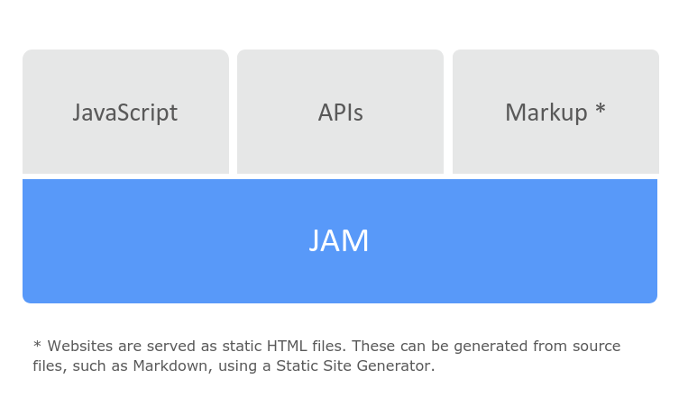
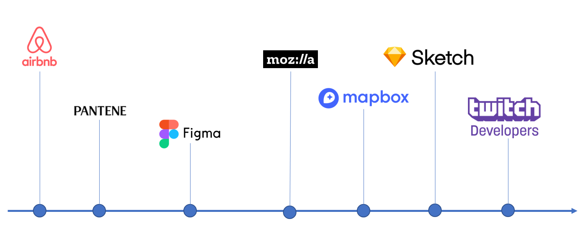

# Modern web architecture

This site was built using a modern web development architecture based on client-side JavaScript, reusable APIs, and prebuilt Markup.

## Structure

## Who use?

## Benefits

### 1. Faster performance

Serve pre-built markup and assets over a CDN.

### 2. Less expensive​

Hosting of static files are cheap or even free.​

### 3. Better developer experience​

Front end developers can focus on the front end. This usually means quicker and more focused development.

### 4. Scalability

If has many active users, is very simple scale your application.
