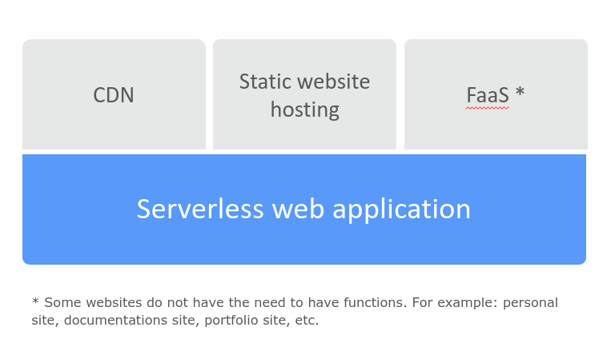
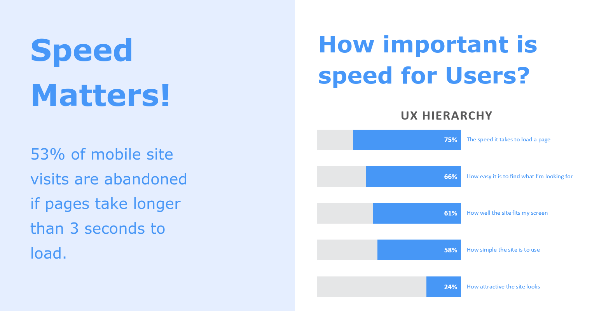
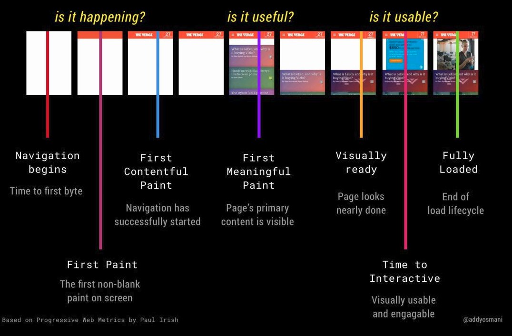

# Serverless web application​

The application development rely solely on a combination of **third-party services**, **client-side logic** and cloud-hosted remote procedure calls (**Functions as a Service**)

## Structure

## Benefits

### 1. Flexible Scaling​

Automatic scaling provisioned by CDN​.

### 2. No Server Management​

There is no available software to support, administer or to maintain.​

### 3. No Idle Capacity​

You will not find the necessity to pre- or over-provision the ability for items like storage or computer.

### 4. High Availability

Designed to have the built-in availability and the fault tolerance.

### The importance of speed to users

Source: https://www.youtube.com/watch?v=mLjxXPHuIJo

### Web Page Usability Matters​

